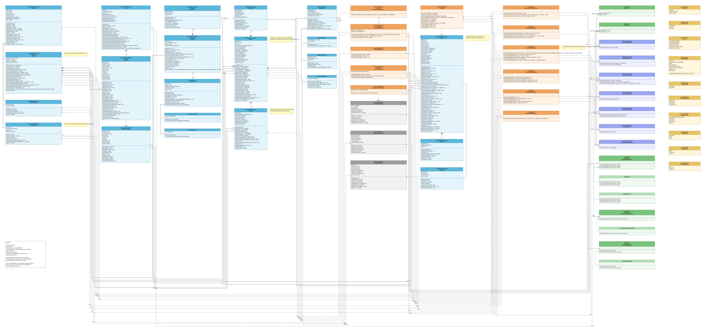

# Delivery de Bebidas

Trabalho da disciplina de Análise e Projeto de Sistemas 2 (UNIFOR): diagrama de classes UML de um aplicativo de delivery de bebidas, modelado com os padrões GRASP de Craig Larman, e o esqueleto do sistema em Java correspondente ao diagrama.

## Conteúdo

O diagrama tem 63 tipos (classes, interfaces e enumerações) e 91 relações, organizados em domínio, serviços, controladores, repositórios e infraestrutura. Os estereótipos indicam qual padrão GRASP justifica cada responsabilidade: Information Expert, Creator, Controller, Polymorphism, Pure Fabrication e Indirection.

O código em `src/main/java/com/delivery` reproduz o diagrama classe por classe, com todos os atributos e assinaturas de método. Os corpos dos métodos estão vazios de propósito: o objetivo é mostrar a estrutura do sistema, não uma implementação executável.

- `dominio` — entidades e enumerações
- `dto` — objetos de transporte devolvidos pelos controladores
- `servico` — invenções puras: catálogo, pagamento, estoque, entrega e relatório
- `controlador` — um controlador por caso de uso
- `repositorio` — repositórios que realizam as interfaces de leitura e escrita
- `infra` — gateways de pagamento, geolocalização e criptografia de senha

## Arquivos

- `docs/diagrama-classes.png` — imagem do diagrama
- `docs/Diagrama_Delivery_v5.drawio` — arquivo editável, abre em app.diagrams.net
- `docs/Diagrama_Delivery_v5.pdf` — o mesmo diagrama em PDF, página única
